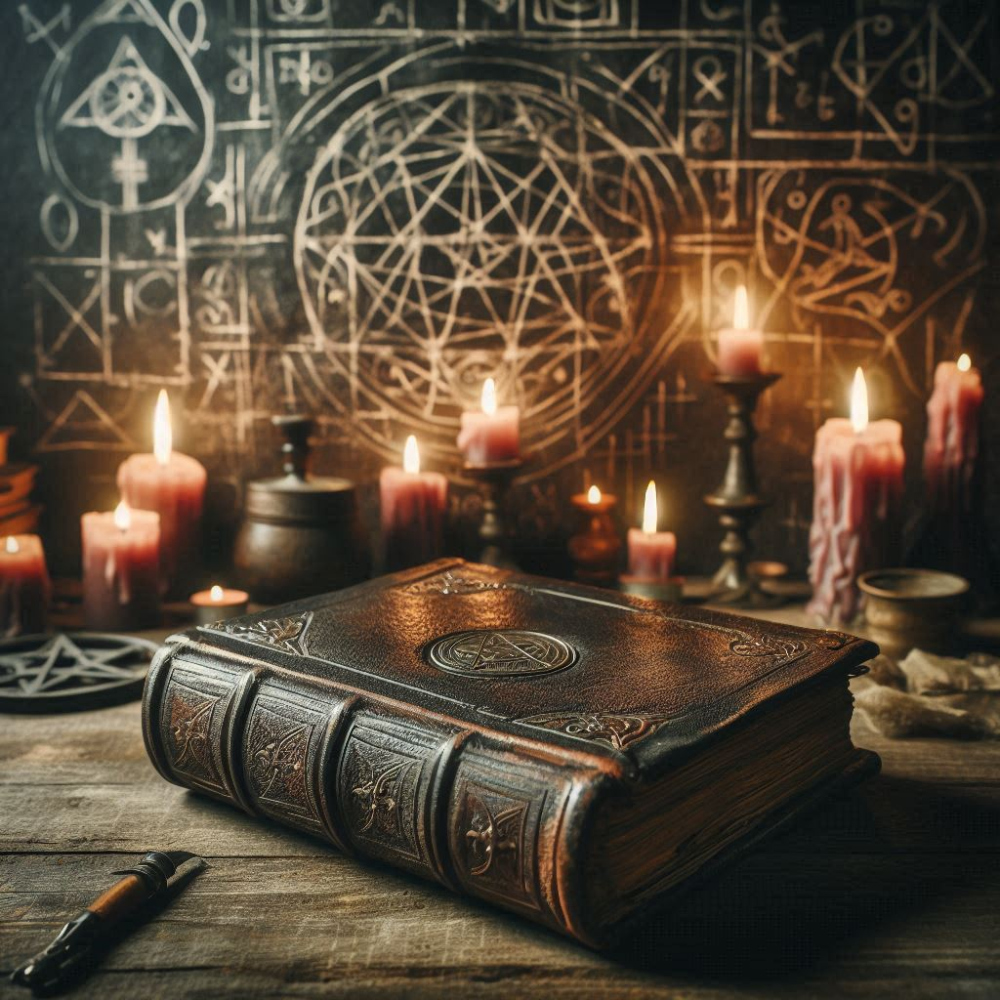

A grimoire is a type of magical textbook or manual, often associated with medieval and Renaissance periods. These books typically contain instructions on how to create magical objects like talismans and amulets, perform spells, summon spirits, and invoke supernatural entities. Grimoires often include:

- **Spells and Incantations:** Detailed instructions on how to cast spells for various purposes, such as protection, love, or wealth.
- **Rituals:** Step-by-step guides for performing magical ceremonies and rites.
- **Astrological Information:** Charts and tables to determine the best times for certain magical activities based on celestial events.
- **Herbal Lore:** Information on the magical properties of plants and how to use them in potions and charms.
- **Symbolism:** Various symbols and sigils used to represent and invoke different powers and entities.

Grimoires were often written in a mix of languages, including Latin, Greek, and Hebrew, and were sometimes encrypted to protect their secrets. They are fascinating artifacts that offer a glimpse into the historical practices of magic and the occult.